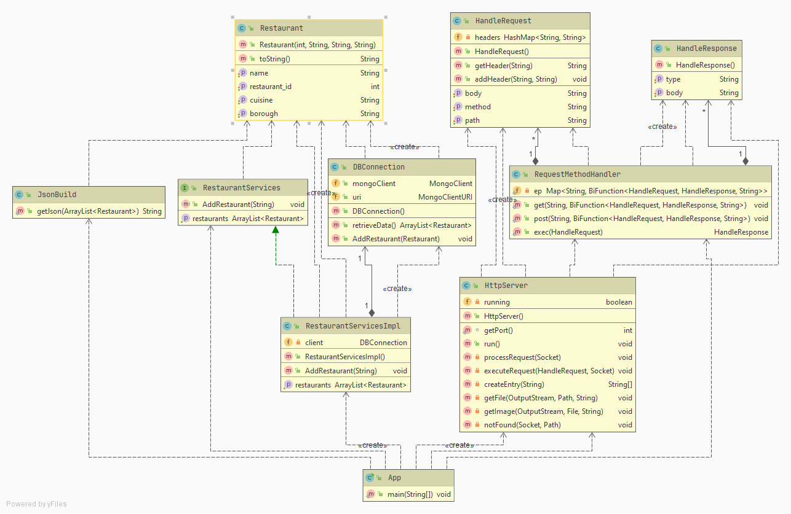
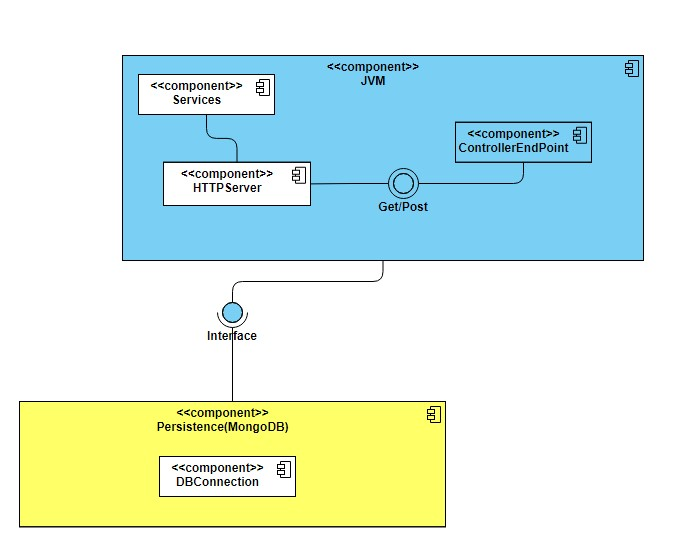
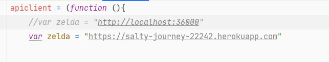

# LAB 3 AREP - Taller Clientes y servicios

## Description

 
   
  
  This project has continuos integration via **CircleCi** 
 
## Design 

  This is the intended design for this project
  
  
  
  

## User's guide

  This is the guide that will setup this proyect at your local machine in order to be able to run it.
  
  ### Requisites
  
  It is necessary having these tools installed on your computer:
  
  * Maven 
  * Java 
  * Git
 
  ### Setting up
  
1. **Clone this repository:** 

   `git clone https://github.com/JohanS11/Lab3Arep.git`

2. **Build the project with maven:**
  
    `cd Lab3Arep && mvn package`

3. **Execute the project with maven:**

    ***Exercise 1:*** 
    
    `mvn exec:java -Dexec.mainClass="edu.eci.arep.lab3.URL.URLReader" `
    
    ***Exercise 2:***  
    
    `mvn exec:java -Dexec.mainClass="edu.eci.arep.lab3.Browser.URLWriter" `
    
    ***Exercise 3:*** 
    
    `mvn exec:java -Dexec.mainClass="edu.eci.arep.lab3.Server.SocketServer" `
    
    y `mvn exec:java -Dexec.mainClass="edu.eci.arep.lab3.Server.SocketClient" `
    
    ***Challenge 1:*** 
    

    `mvn exec:java -Dexec.mainClass="edu.eci.arep.lab3.Challenge1.App" `
    
    now you can navigate trough Static files like:
    
    - / -> index.html.
    - lee.png
    - notFound.html
    - restaurants.html
    - text.js
    
    ***Challenge 2:*** 
    
     `mvn exec:java -Dexec.mainClass="edu.eci.arep.lab3.Challenge2.App" `
     
     now you can get Request data from a MongoDB server from the restaurants collection.
     You can also do post request to this database.
     
     ***NOTE*** 
     
     Change this url in order to see the request and the post from the database locally
     
     

     (Go through **restaurants.html** to server requesting from the database)
    
   ### Architecture Description
   
   You can find the architecture description of this project at 
    [Architecture Description](https://github.com/JohanS11/Lab3Arep/blob/master/Architecture.pdf)

   ### Executing tests
   
     In order to run the tests developed with JUnit you have run the follow command:
     
     `mvn test`
   
  ## This project was built with:
  
   - Apache Maven 3.6.3 
   - Java 1.8.0_211
   - Git 2.26.2
   
  
  ## Java Documentation
  
  In order to generate javadoc execute `mvn javadoc:javadoc`
  
  ## Author
  
  Johan Sebastian Arias Amador ([JohanS11](https://github.com/JohanS11))
  
  ## License
  
  This project is licensed under the GNU General Public License v3.0 - see the [LICENSE](https://github.com/JohanS11/Lab3Arep/blob/master/LICENSE) file for more details.

